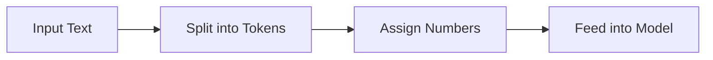
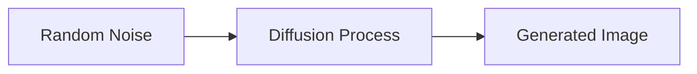
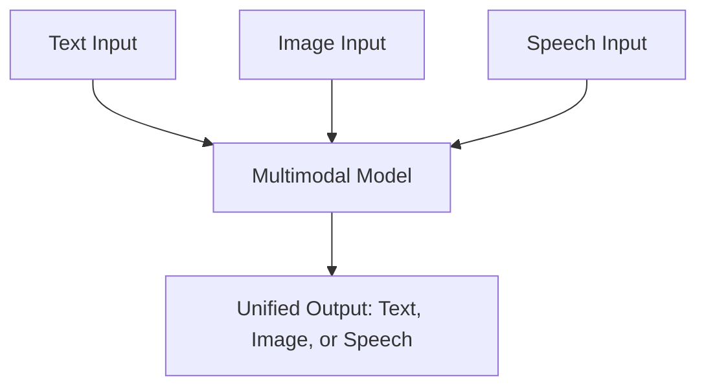

# 📘 Week 2: Conceptual Overview of Generative Models  
**Course:** Introduction to Generative AI  
**Instructor:** Kirtan Ramwani  

---

## 🎯 Learning Objectives
- Understand what **generative models** are.  
- Learn how **text and image generation** works.  
- Explore **Large Language Models (LLMs)**, tokenization, parameters, and hyperparameters.  
- Differentiate between **proprietary vs open-source models**.  
- Grasp the role of **multimodal AI systems**.  

---

## 🌱 What is Generative AI?

Generative AI refers to systems that **produce new content** — text, images, code, audio, and video — based on prompts or input data.  

### ✅ Examples of Generative AI tools (2025)
- **Text:** ChatGPT (GPT-4o), Claude 4/Opus, Gemini 2.5 Pro, Microsoft Copilot  
- **Images:** DALL·E, Midjourney, Google Imagen  
- **Video:** Runway ML, Sora, Pika, Flow  
- **Code:** GitHub Copilot, OpenAI Codex, Replit, Claude Code  

> 🧩 **Analogy:** Generative AI is like a chef who has tasted millions of dishes and can now **invent new recipes** inspired by everything they’ve learned.  


#### Real-World Example: Text Generation
**Prompt:** "Write a poem about the ocean."
**Output (ChatGPT):**
> The ocean whispers tales of blue,\nOf distant lands and mornings new.\nWaves that dance and seagulls cry,\nBeneath the ever-changing sky.

#### Real-World Example: Image Generation
**Prompt:** "A futuristic city at sunset, digital art."
**Output (DALL·E):**


#### Real-World Example: Code Generation
**Prompt:** "Write a Python function to reverse a string."
**Output (GitHub Copilot):**
```python
def reverse_string(s):
	return s[::-1]
```


---

## 🔑 Tokenization

Tokenization is how AI models **break text into smaller chunks (tokens)** and convert them into numbers for processing. This is the first step before a model can "understand" or generate language.

#### Step-by-Step Example
**Text:** "Flowers are blooming in the garden."

1. Start with the text you want to tokenize.
2. Split the words in the text based on a rule. For example, split the words where there's a white space.
3. Remove stop words—common words like "are", "in", and "the" that may not carry significant meaning.
4. Assign a number to each unique token.

| Step | Action              | Result                                                 |
| ---- | ------------------- | ------------------------------------------------------ |
| 1    | Start with the text | "Flowers are blooming in the garden"                   |
| 2    | Split into tokens   | \["Flowers", "are", "blooming", "in", "the", "garden"] |
| 3    | Stop word removal   | \["Flowers", "blooming", "garden"]                     |
| 4    | Assign IDs          | \[101, 202, 303]                                       |


<div align="center"><sub>Image credit: Miro Medium</sub></div>

> 🔍 **Analogy:** Tokens are like LEGO blocks. Individually simple, but combined, they can build paragraphs, stories, or entire books.

#### Visual: Tokenization Flow

#### Types of tokenization: 


<div align="center"><sub>Image credit: Miro Medium</sub></div>


## Tokenization Methods Comparison

| Word-Level Tokenization                     | Character-Level Tokenization              |
|---------------------------------------------|-------------------------------------------|
| ✅ Captures meaning of words                | ✅ Small vocabulary size                   |
| ✅ Suitable for language modeling           | ✅ No Out of Vocabulary (OOV) problem      |
| ❌ Out of Vocabulary (OOV) issues           | ❌ Longer sequence length                  |
| ❌ Large vocabulary size                    | ❌ No context meaning                      |
|                                             | ❌ Not suitable for language modeling      |


Use this tool to see how OpenAI models tokenize your input text — useful for prompt design and staying within token limits.  
https://platform.openai.com/tokenizer


```python
# Using Hugging Face tokenizer in Colab
!pip install --upgrade transformers

import os
os.environ["HF_token"] = "your hf api key"

from transformers import AutoTokenizer
tokenizer = AutoTokenizer.from_pretrained("google/gemma-3-1b-it", token=os.environ["HF_token"])
print(tokenizer("Hello, World!"))

```
---

## ⚙️ Model Parameters vs Hyperparameters

**Parameters** are the internal values a model learns during training (like weights in a neural network). **Hyperparameters** are settings you choose before training (like learning rate, batch size).

#### Example: Parameters vs Hyperparameters
- **Parameter:** The weight connecting two neurons in a neural network (learned by the model).
- **Hyperparameter:** The number of layers in the network (set by the engineer).

| Type               | Example                       | Description                            |
| ------------------ | ----------------------------- | -------------------------------------- |
| **Hyperparameter** | `learning_rate`, `num_epochs` | Set by *you* before training           |
| **Parameter**      | `weight`, `bias`              | *Learned* by the model during training |

### 📌 Hyperparameters vs Parameters

**Hyperparameters** (you set):

- `learning_rate = 0.01` → How fast the model learns
- `epochs = 100` → How many times the model goes through the data

**Parameters** (model learns):

- `weight = 200` → Price increase per square foot
- `bias = 50,000` → Base price of the house
---

## 🧠 Large Language Models (LLMs)


Large Language Models (LLMs) are AI systems trained on huge amounts of text (trillions of words) to generate and understand language. They use the transformer architecture, which allows them to "pay attention" to context and relationships in text.

#### Example: LLM in Action
**Prompt:** "Explain gravity to a 10-year-old."
**Output:**
> Gravity is like an invisible hand that pulls everything down to the ground. It's why when you jump, you come back down!

#### Visual: Transformer Architecture (TensorFlow)

<div align="center"><sub>Image credit: TensorFlow, <a href="https://aiml.com/explain-the-transformer-architecture/">Transformer Architecture</a></sub></div>


### 🚀 Using Transformers & OpenAI Embeddings in Colab

```python
# Install required libraries
!pip install openai transformers

# OpenAI embedding
import openai
client = openai.OpenAI(
    api_key="sk-proj-..."  # Replace with your actual key
)
response = client.embeddings.create(
    input="Cat loves milk",
    model="text-embedding-3-small"
)
print(response.data[0].embedding)
print(len(response.data[0].embedding))

# Tokenization with Hugging Face
from transformers import AutoTokenizer
import os
os.environ["HF_token"] = "your_hf_token"
tokenizer = AutoTokenizer.from_pretrained("google/gemma-3-1b-it", token=os.environ["HF_token"])
input_tokens = tokenizer("Write a python code to print Hello,World!", return_tensors="pt")

# Load model and run inference
import torch
from transformers import AutoModelForCausalLM
model = AutoModelForCausalLM.from_pretrained("google/gemma-3-1b-it", token=os.environ["HF_token"], torch_dtype=torch.float16)
out = model(input_ids=input_tokens["input_ids"])
print(out)

# Generate output
gen_out = model.generate(input_ids=input_tokens["input_ids"], max_new_tokens=100)
print(gen_out)

# Decode output
print(tokenizer.batch_decode(gen_out))

```
---

## 🎨 Basics of Image Generation

- **GANs (Generative Adversarial Networks):**
	- The generator creates fake images, the discriminator tries to spot fakes, and both improve over time.
	- 
	- **Example:**
		- Generator input: random noise
		- Output: a realistic-looking face (not a real person!)
		- [ThisPersonDoesNotExist.com](https://thispersondoesnotexist.com/) shows GAN-generated faces.

- **Diffusion Models:**
	- Start from pure noise and gradually "denoise" to create a clear image.
	- 
	- **Example:**
		- Input: random noise
		- Output: a picture of cat sitting (after many denoising steps)



> 🎨 **Analogy:** Diffusion models are like a photographer developing film. At first blurry, the picture becomes clearer with each step.


---

## 🔄 Multimodal Models

Multimodal models can process and generate multiple types of data at once—like text, images, and audio—making them more flexible and powerful.

#### Example: Multimodal AI
- **Prompt:** Upload a photo and ask, "What is happening in this image?"
- **Output:** "A group of students are working together on a robotics project."

#### Visual: Multimodal Model
- 
<div align="center"><sub>Image credit: Medium.com</sub></div>

### Examples
- **Proprietary:** GPT-4o (OpenAI), Gemini 2.5 Ultra
- **Open-Source:** LLaMA 3.2 Vision, Kosmos-2



---

## 🏷 Proprietary vs Open-Source LLMs

| Aspect        | Proprietary Models         | Open-Source Models         |
|--------------|---------------------------|---------------------------|
| Examples     | GPT-4o, Claude 4, Gemini 2.5 | LLaMA 4 Scout, Gemma 2, Mistral |
| Access       | APIs or apps only          | Weights freely available   |
| Customization| Limited                    | Full fine-tuning possible  |
| Deployment   | Cloud only                 | Local or cloud            |
| Privacy      | Data handled by provider   | User-controlled data       |

> 🚗 **Analogy:** Proprietary = renting a car (easy, polished, but limited control). Open-Source = owning a car (customizable, but you maintain it).
- 
<div align="center"><sub>Image credit: datasciencedojo</sub></div>

### Popular LLMs (2025)
- **Proprietary:** GPT-4o, Claude 4, Gemini 2.5 Pro, Ernie 4.5
- **Open-Source:** LLaMA 4 Scout, Gemma 2, Mistral, DeepSeek R1
---


## 📈 Summary
- Generative AI produces new content across modalities.
- Tokenization = foundation of text models.
- Parameters vs Hyperparameters: learned vs chosen settings.
- LLMs power chatbots, search, coding, and more.
- Image generation often uses GANs or diffusion models.
- Multimodal models can combine text, vision, and audio.
- Proprietary vs open-source: convenience vs control tradeoff.

---

## 📺 Resources
- [Aiml.com – transformer-architecture](https://aiml.com/explain-the-transformer-architecture/)
- [TensorFlow – Transformers](https://www.tensorflow.org/text/tutorials/transformer)
- [Datasciencedojo – open-source-llm](https://datasciencedojo.com/blog/open-source-llm/)
---


